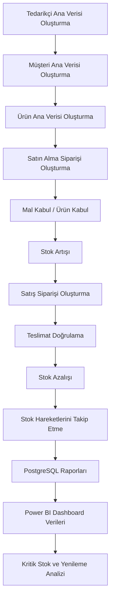

# Odoo Süreç Akışı

## Uçtan Uca ERP Akışı

Bu dosyada Odoo tarafında kurguladığım satın alma, mal kabul, satış, teslimat ve stok hareketleri sürecini özetledim.

## Süreç Adımları

### 1. Tedarikçi Ana Verisi

İlk olarak Odoo Contacts modülünde tedarikçi kayıtlarını hazırladım.

Örnek tedarikçiler:

- Anadolu Electronics
- OfficePro Supply
- TechnoSource B2B
- Global Office Supplier
- Akdeniz Computer Systems

### 2. Müşteri Ana Verisi

Aynı modülde müşteri kayıtlarını da oluşturdum.

Örnek müşteriler:

- ABC Consulting
- Mavi Software
- Delta Academy
- Northwind Logistics
- Bright Future Education

### 3. Ürün Ana Verisi

Ürünleri maliyet, satış fiyatı, minimum stok ve maksimum stok bilgileriyle tanımladım.

Bu bilgiler daha sonra satın alma, satış, stok kontrolü ve yenileme analizi için temel veri oldu.

### 4. Satın Alma Siparişi

Tedarikçilerden ürün almak için satın alma siparişleri oluşturdum.

Örnek:

- PO-001: Anadolu Electronics
- PO-002: OfficePro Supply

### 5. Mal Kabul

Satın alınan ürünler geldiğinde Inventory tarafında mal kabul adımını düşündüm.

Bu hareketi SQL modelinde `SATIN_ALMA_GIRIS` olarak temsil ettim.

### 6. Stok Artışı

Mal kabulden sonra ürünlerin stok miktarı artıyor.

Örnek olarak 30 adet Wireless Mouse mal kabulü, Wireless Mouse stok miktarını 30 artırıyor.

### 7. Satış Siparişi

Müşteri talebi için Sales modülünde satış siparişi oluşturdum.

Örnek:

- SO-001: ABC Consulting

### 8. Teslimat Doğrulama

Satış siparişi teslim edildiğinde Inventory tarafında teslimat doğrulaması yapılıyor.

Bu hareketi SQL modelinde `SATIS_CIKIS` olarak temsil ettim.

### 9. Stok Azalışı

Teslimat sonrası ilgili ürünlerin stok miktarı azalıyor.

Örnek olarak 5 adet Wireless Mouse teslimatı, Wireless Mouse stok miktarını 5 azaltıyor.

### 10. Stok Hareket Takibi

Mal kabul ve teslimat adımlarını stok hareketi olarak tuttum.

Böylece ürün bazında stok geçmişi, belge referansı ve hareket türü üzerinden analiz yapılabiliyor.

### 11. PostgreSQL Raporlama

Odoo'daki süreci ayrı bir PostgreSQL raporlama modeliyle temsil ettim.

Bu model üzerinden mevcut stok, kritik stok, tedarikçi harcaması, satış performansı ve brüt kar gibi raporları hazırladım.

### 12. Power BI Analizi

Power BI için hem CSV dosyaları hem de SQL sorguları ekledim.

Bu verilerle ürün bazlı stok, kritik stok, tedarikçi harcaması, satış performansı ve yenileme önerileri görselleştirilebilir.
