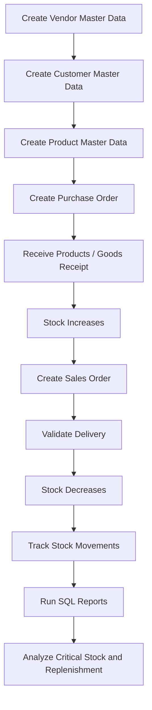

# Process Flow

## End-to-End ERP Flow

This case study follows a typical procurement-to-inventory-to-sales process.

## Process Step Details

### 1. Vendor Master Data

Vendors are created to represent companies that supply products to NovaTech Office Supplies.

Example vendors:

- Anadolu Electronics
- OfficePro Supply
- TechnoSource B2B
- Global Office Supplier
- Akdeniz Computer Systems

### 2. Customer Master Data

Customers are created to represent business partners that buy products.

Example customers:

- ABC Consulting
- Mavi Software
- Delta Academy
- Northwind Logistics
- Bright Future Education

### 3. Product Master Data

Products are created with cost, sales price, minimum stock, and maximum stock values.

These values support purchasing, sales, inventory tracking, and replenishment reporting.

### 4. Purchase Order Creation

Purchase Orders are created when products need to be ordered from vendors.

Example:

- PO-001 is created for Anadolu Electronics.
- PO-002 is created for OfficePro Supply.

### 5. Goods Receipt

When purchased products arrive, the receipt is validated.

This creates a stock movement with movement type `PURCHASE_IN`.

### 6. Stock Increase

After the Goods Receipt, product stock increases.

Example:

- Receiving 30 Wireless Mouse units increases stock by 30.

### 7. Sales Order Creation

Sales Orders are created when customers order products.

Example:

- SO-001 is created for ABC Consulting.

### 8. Delivery Validation

When the customer order is shipped, the delivery is validated.

This creates a stock movement with movement type `SALES_OUT`.

### 9. Stock Decrease

After delivery, stock decreases.

Example:

- Delivering 5 Wireless Mouse units decreases stock by 5.

### 10. Stock Movement Tracking

Every receipt and delivery is tracked as a stock movement.

This allows the business to review stock history by product, date, movement type, and document reference.

### 11. Critical Stock Analysis

Current stock is compared with minimum stock.

Products below minimum stock are flagged for review.

### 12. SQL-Based Reporting

SQL reports provide operational visibility for procurement and inventory management.

Reports include current stock, critical stock, vendor spend, sales performance, gross margin, and replenishment suggestions.
