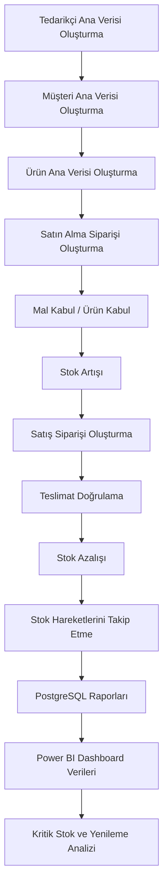

# Odoo Süreç Akışı

## Uçtan Uca ERP Akışı

Bu proje, Odoo üzerinde uygulanan satın alma, mal kabul, satış, teslimat ve stok hareketleri sürecini gösterir.

## Süreç Adımları

### 1. Tedarikçi Ana Verisi

Odoo Contacts modülünde tedarikçi kayıtları oluşturulmuştur.

Örnek tedarikçiler:

- Anadolu Electronics
- OfficePro Supply
- TechnoSource B2B
- Global Office Supplier
- Akdeniz Computer Systems

### 2. Müşteri Ana Verisi

Odoo Contacts modülünde müşteri kayıtları oluşturulmuştur.

Örnek müşteriler:

- ABC Consulting
- Mavi Software
- Delta Academy
- Northwind Logistics
- Bright Future Education

### 3. Ürün Ana Verisi

Odoo'da ürünler maliyet, satış fiyatı ve stok takip bilgileriyle hazırlanmıştır.

Bu bilgiler satın alma, satış, stok kontrolü ve yenileme analizi için temel veri olarak kullanılır.

### 4. Satın Alma Siparişi

Tedarikçilerden ürün almak için satın alma siparişleri oluşturulmuştur.

Örnek:

- PO-001: Anadolu Electronics
- PO-002: OfficePro Supply

### 5. Mal Kabul

Satın alınan ürünler geldiğinde Odoo Inventory tarafında mal kabul işlemi yapılmıştır.

Bu işlem stok hareketlerinde `SATIN_ALMA_GIRIS` olarak temsil edilir.

### 6. Stok Artışı

Mal kabul sonrası ürünlerin stok miktarı artar.

Örnek:

- 30 adet Wireless Mouse mal kabulü, Wireless Mouse stok miktarını 30 artırır.

### 7. Satış Siparişi

Müşteri talebi için Odoo Sales modülünde satış siparişi oluşturulmuştur.

Örnek:

- SO-001: ABC Consulting

### 8. Teslimat Doğrulama

Satış siparişi teslim edildiğinde Odoo Inventory tarafında teslimat doğrulanır.

Bu işlem stok hareketlerinde `SATIS_CIKIS` olarak temsil edilir.

### 9. Stok Azalışı

Teslimat sonrası ilgili ürünlerin stok miktarı azalır.

Örnek:

- 5 adet Wireless Mouse teslimatı, Wireless Mouse stok miktarını 5 azaltır.

### 10. Stok Hareket Takibi

Her mal kabul ve teslimat işlemi stok hareketi olarak takip edilir.

Bu takip, ürün bazında stok geçmişini, belge referanslarını ve hareket türlerini analiz etmeyi sağlar.

### 11. PostgreSQL Raporlama

Odoo'da uygulanan süreç ayrı bir PostgreSQL raporlama modeliyle temsil edilmiştir.

Bu model üzerinden mevcut stok, kritik stok, tedarikçi harcaması, satış performansı ve brüt kar gibi raporlar hazırlanmıştır.

### 12. Power BI Analizi

Power BI için hazır CSV dosyaları ve SQL sorguları eklenmiştir.

Bu verilerle ürün bazlı stok, kritik stok, tedarikçi harcaması, satış performansı ve yenileme önerileri görselleştirilebilir.
